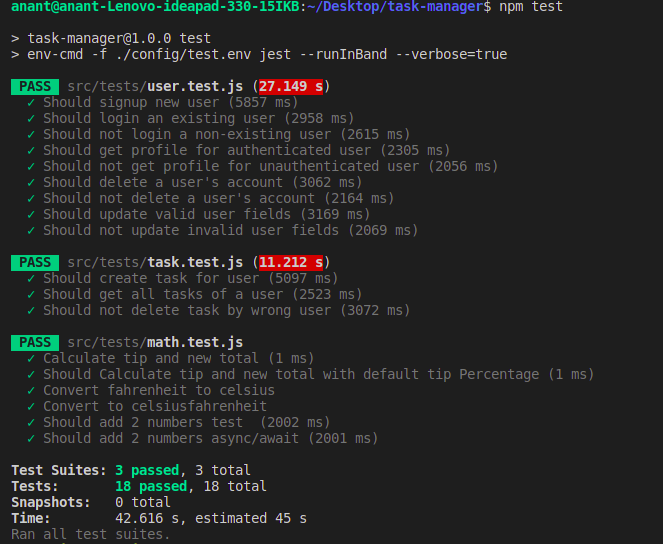

# Backend API testing using Jest

This repo contains some introductory level basic tests using Jest and SuperTest library. The project used here is a sample Node/Express task-manager app

### Credits:

Andrew Mead (https://www.udemy.com/course/the-complete-nodejs-developer-course-2/)
